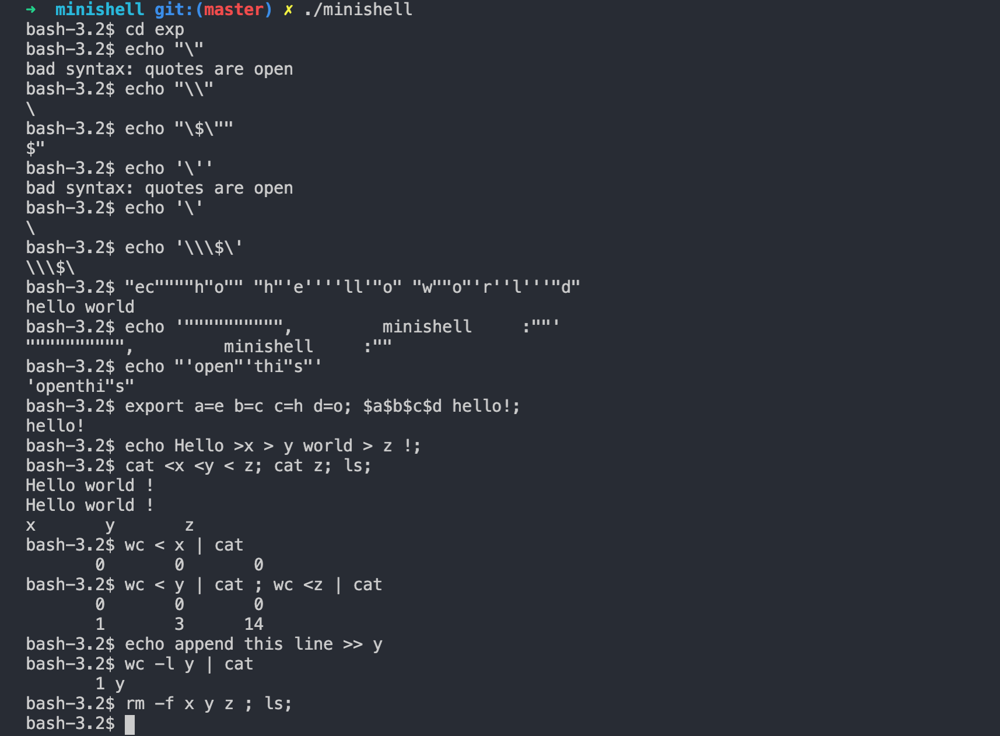

# minishell

 
O minishell é uma aplicação que permite ao utilizador interagir com o sistema operativo através de comandos de linha de comando.  O&nbsp; projecto inclui as seguintes funcionalidades: 
      Exibir um prompt quando esperando por um novo comando. 
     Possuir um histórico de comandos funcional. 
     Procurar e lançar o executável correto (com base na variável PATH ou usando um caminho relativo ou absoluto). 
     Não usar mais do que uma variável global. 
     Não interpretar aspas não fechadas ou caracteres especiais que não são necessários para o projeto, como \ (barra invertida) ou ; (ponto e vírgula). 
     Lidar com ' (aspas simples) que deve impedir que o shell interprete os meta-caracteres na sequência entre aspas. 
     Lidar com " (aspas duplas) que deve impedir que o shell interprete os meta-caracteres na sequência entre aspas, exceto $ (sinal de dólar). 
     Além disso, o shell também implementa as seguintes funcionalidades avançadas: Redirecionamentos: &lt; para redirecionar a entrada, &gt; para redirecionar a saída, 1 Malformed citation &lt;&lt; para ler a entrada até ver uma linha com o delimitador especificado, mas sem atualizar o histórico, &gt;&gt; para redirecionar a saída no modo de adição. 
     Pipes ( | caractere), onde a saída de cada comando no pipeline é conectada à entrada do próximo comando através de um pipe. 
     Lidar com variáveis de ambiente ($ seguido por uma sequência de caracteres) que devem expandir para seus valores. 
     Lidar com $? que deve expandir para o status de saída do pipeline mais recentemente executado no foreground. 
     Lidar com ctrl-C, ctrl-D e ctrl-\ que devem se comportar como no bash. 
     Modo interativo: ctrl-C exibe um novo prompt em uma nova linha, ctrl-D sai do shell, ctrl-\ não faz nada. 
     Implementar os seguintes builtins: echo com a opção -n, cd com apenas um caminho relativo ou absoluto, pwd sem opções, export sem opções, unset sem opções, env sem opções ou argumentos, exit sem opções.

##Authors [Lucas Luperi](https://github.com/lucas12ps) && [Luis Santos](https://github.com/akadjoker , https://github.com/lrosa-do)

## Usage

